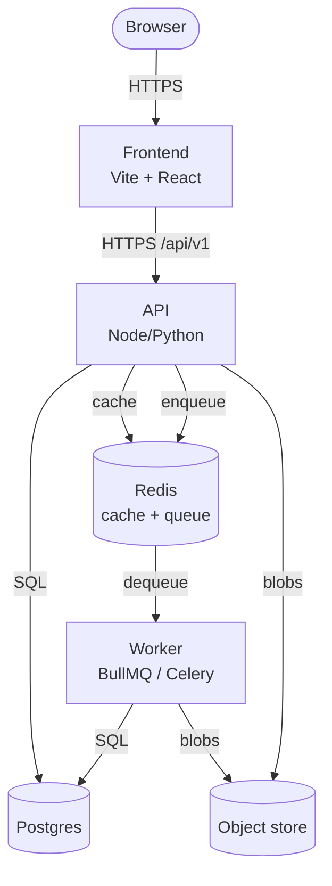

# Google — Architecture

> How the system is built. Read this _before_ changing anything load-bearing.

---

## 1. Context

**Problem:** {{PROBLEM_STATEMENT}}

**Solution shape:** {{SOLUTION_SHAPE}}

**Constraints:** {{CONSTRAINTS}}

## 2. High-level diagram (C4 Container view)



For canonical C4 (Structurizr DSL): see `docs/architecture/workspace.dsl` (standard profile).

## 3. Components

### Frontend (`apps/web/`)

- **Stack:** TODO
- **State:** {{STATE_LIB}} (one store per domain)
- **API client:** `src/lib/api.ts` (single entry point; no bare `fetch` in components)
- **Routing:** {{ROUTER}}

### API (`apps/api/`)

- **Stack:** {{API_STACK}}
- **Validation:** Zod (TS) / Pydantic (Python) at every route boundary
- **ORM:** {{ORM}}
- **Auth:** {{AUTH_SCHEME}}
- **Errors:** typed (`AppError` hierarchy); never bare `throw`

### Shared domain (`packages/shared/`)

- **Schemas:** all Zod / Pydantic schemas
- **Enums:** all status enums, role enums
- **State machine:** in `state/workflow.ts`
- **Types:** generated from schemas where possible

### Worker (`apps/api/src/worker.ts`)

- **Queue:** BullMQ on Redis
- **Jobs:** {{JOB_TYPES}}
- **Retries:** 3 with exponential backoff
- **DLQ:** failed jobs land in `:dead` queue, alerts on count > 10

### Storage

- **Postgres:** primary store (transactional)
- **Redis:** cache + queue (ephemeral)
- **Object store:** {{OBJECT_STORE}} (binary blobs)

## 4. Data flow

```
1. User action  → Frontend component
2. Component    → src/lib/api.ts (axios/fetch wrapper)
3. API route    → Zod validate → service layer
4. Service      → Repository (Prisma/SQLAlchemy)
5. DB           → response
6. Worker (async) → BullMQ → handler → side effects
```

## 5. Contracts

**API:** all routes under `/api/v1/*`. OpenAPI spec generated from Zod schemas at build time.

**Events:** worker jobs are typed; see `packages/shared/jobs/`.

**Database:** schema in `apps/api/prisma/schema.prisma` (or `alembic/versions/`). Migrations forward-only.

## 6. Cross-cutting concerns

| Concern     | Approach                                                         |
| ----------- | ---------------------------------------------------------------- |
| Logging     | Structured JSON via Pino / structlog; correlation ID per request |
| Metrics     | OpenTelemetry → Prometheus / Grafana                             |
| Tracing     | OTLP exporter (env-configured)                                   |
| Errors      | Sentry SDK; release sourcemap upload                             |
| Auth        | JWT (short-lived) + refresh token (httpOnly cookie)              |
| Rate limits | Redis token bucket on `/api/v1/*`                                |
| Secrets     | `.env` (dev), {{SECRET_MGR}} (prod)                              |

## 7. Performance budgets

| Metric         | Budget          |
| -------------- | --------------- |
| API p95        | < 200ms         |
| API p99        | < 500ms         |
| Worker job p95 | < 5s            |
| Frontend LCP   | < 2.5s          |
| Bundle size    | < 250kb gzipped |

## 8. Design principles

1. **One source of domain truth** — schemas, enums, state machine in `packages/shared/` only.
2. **Boundary validation** — Zod / Pydantic at every entry point.
3. **Typed errors** — never throw raw `Error`; use `AppError` hierarchy.
4. **No silent failure** — every catch logs at minimum; many re-throw.
5. **Forward-only migrations** — never edit a shipped migration.

## 9. Open questions

- {{OPEN_Q_1}}
- {{OPEN_Q_2}}

## 10. See also

- [ROADMAP.md](ROADMAP.md) — what's coming
- [ISSUES_AND_LEARNINGS.md](ISSUES_AND_LEARNINGS.md) — what bit us
- [../docs/04-quality/adr/](../docs/04-quality/adr/) — why each decision was made
