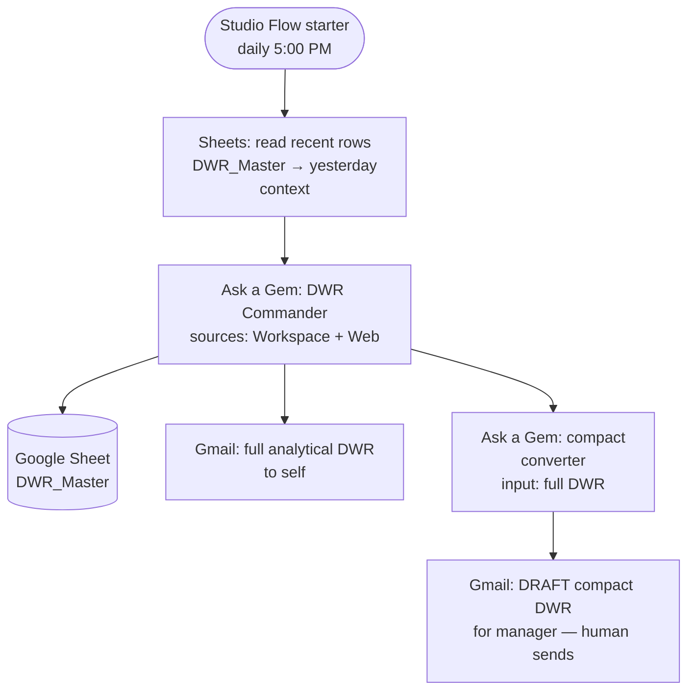
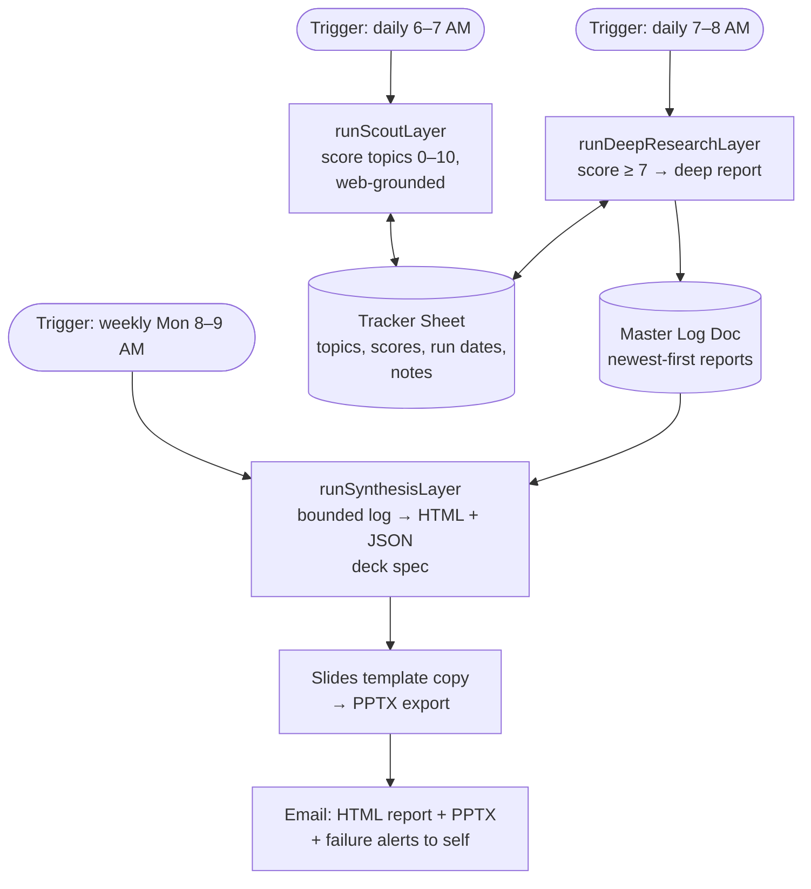

<div align="center">

# 🤖 CH-Google — Google Workspace AI Automation

### Correcting two AI-drafted automations — a Daily Working Report agent and a market/supply-chain research engine — from confident, defective blueprints into an evidence-gated, version-controlled record, before either one touches a manager's inbox.

**Zero paid infrastructure** · everything runs inside one Google Workspace account · Gemini Gems + Workspace Studio Flows + Apps Script

<br/>

[](STATUS.md)
[-blue?style=for-the-badge)](docs/01-session/SESSION-2026-08-27-critic-google-establishment.md)
[](src/apps-script/README.md)
[](02_active/ARCHITECTURE.md)
[-orange?style=for-the-badge)](STATUS.md)

[](src/apps-script/Code.gs)
[](02_active/ARCHITECTURE.md)
[](src/apps-script/appsscript.json)
[](docs/atlas.json)
[-lightgrey)](STATUS.md)
[](LICENSE)

<sub>Every badge above is basis-true as of 2026-08-30 — verified this run against the repo's own files, `git`, and the atlas. No number here is decorative.</sub>

</div>

---

<!-- ATLAS:BEGIN (generated by build-project-atlas.py - do not edit inside) -->
<p align="center">
  <picture>
    <source media="(prefers-color-scheme: dark)" srcset="docs/atlas-dark.svg">
    
  </picture>
</p>
<p align="center"><sub>Generated by <a href="scripts/07-visualize/build-project-atlas.py"><code>build-project-atlas.py</code></a> - re-run it after any meaningful change. It is a <em>derived</em> view (D-009 R6); fix the source, then re-render.</sub></p>
<!-- ATLAS:END -->

## ⚡ The story in 30 seconds

Two recurring owner tasks — writing the Daily Working Report for management, and producing recurring market/supply-chain research briefings — were designed as **Gemini chat-export blueprints** on 2026-08-16: confident, detailed, and never run against a real Google account. A 3-pass adversarial critic loop found the Research Engine's script never did what it claimed — the prompts said "scan the web" while the payload sent zero grounding tools, three deck-rendering bugs sat behind a success log, and the manager-facing email step was designed to **auto-send** unreviewed LLM output with no defense against prompt injection from the inbound mail/chat it reads.

One session later:

| | Before | After | Proof |
|---|---|---|---|
| Verified Research-Engine defects | 13 unfixed (1 CRITICAL, 5 MAJOR, 7 MODERATE/MINOR) | **13/13 corrected** in `Code.gs` v3.1 | [full delta table](src/apps-script/README.md) |
| Manager-facing auto-send risk | blueprint Step 6: auto-**Send**, no injection guard | corrected to **Draft-only** + injection guard (D2) — human reviews and sends | [`ARCHITECTURE.md` §2](02_active/ARCHITECTURE.md) |
| Durable, versioned record | 0 — blueprints lived only as untracked chat-export PDFs | **269 tracked files**, 9 commits, this repo | `git ls-files` / `git log`, this README's commit |
| Critic-loop adjudicated score | — | **39/100** (bound by the immutable blueprint exports) · establishment sub-score **82/82/79**, up from 41/40/36 | [`COVERAGE.md` §E](docs/04-quality/critic/COVERAGE.md) |
| Deployment evidence, either system | — | — | honestly `not measured` — neither system deployed yet |

The trick wasn't speed — it was treating an AI-authored blueprint as a **draft to be adversarially reviewed**, not a deliverable to be pasted in: the corrected record now lives in this repo, not in a chat export.

## 🗺️ Architecture

Both systems live entirely inside Google Workspace — no servers, no hosting, no infra bill. The diagrams below are the **corrected** design (post-critic-loop); the full page with all D1–D8 flow corrections and the v3.1 delta table lives in [`02_active/ARCHITECTURE.md`](02_active/ARCHITECTURE.md).

### DWR Agent — Gem + Workspace Studio Flow



### Research Engine — Apps Script + Gemini API



## 🧱 What the critic loop caught — and v3.1 fixed

| # | Blueprint defect (v3.0) | v3.1 fix | Severity |
|---|---|---|---|
| 1 | Prompts said "scan the web" — the payload sent **zero grounding tools**; every "market intelligence" answer was model priors | `tools:[{google_search:{}}]` on Scout/Research + a loud warning when grounding metadata is missing | CRITICAL |
| 2 | Every layer's `catch` = `Logger.log` only — silent failure, and it suppressed Apps Script's own built-in trigger-failure emails | Email alert + tracker Execution Notes on every layer failure; errors rethrown | MAJOR |
| 3 | A client-error `throw` was swallowed by its own `catch` — one bad key burned the entire retry cascade on a 400 | Response-code classification: 429/5xx retry, 400/401/403 fail fast with the real message | MAJOR |
| 4 | First-run crash path: date math ran on an empty Next-Run cell **before** the emptiness guard, outside any `try` | Emptiness + `isNaN` checked before any date math | MAJOR |
| 5 | Deck order reversed (`duplicate()` inserts after the master, so forward iteration stacked slides backwards) + "Bullet point 2/3" residue on every slide | Duplicates in reverse → in-order deck; bullets replaced individually | MAJOR |
| 6 | PPTX export response code never checked — a 200-status error page could attach as a broken `.pptx` | Response code checked (`muteHttpExceptions`); non-200 raises loudly | MAJOR |

+ 7 more MODERATE/MINOR fixes (a retired model still sat in the cascade, the API key leaked into logs via a URL query param, no concurrency guard against overlapping triggers, unbounded retry on a permanently-failing topic) — full 13-row table with critic-finding IDs: [`src/apps-script/README.md` §2](src/apps-script/README.md).

## ⚠️ Honest state (named, not waived)

- **Incident-priority, owner action:** the live DWR Studio Flow's real state is **unverified** — if the owner's own "[have Done]" tag is accurate, the *uncorrected* flow (auto-send to manager, no injection guard, 1-year schedule expiry) may be running today at 5 PM. Assume live until confirmed off or corrected. → [`STATUS.md` Blockers](STATUS.md)
- **No deployment evidence for either system.** The corrected `Code.gs` v3.1 is parse-checked only (Node `new Function`), never executed; the DWR flow's Studio-side behavior (source access, failure notifications) is unverified. → [`PROJECT_ARTIFACT.md` §12](PROJECT_ARTIFACT.md)
- **No git remote** (L-008/D-016) — this repo is local-only; the previous README's CI/OpenSSF badges named an unconfirmed identity and were removed rather than kept decorative.
- **The critic-loop score is a bound, not a grade of this record.** 39/100 adjudicated is capped by the *immutable* founding blueprint PDFs (untracked, unfixable by design) — the establishment target itself reached 82/82/79 (STRONG band, up from 41/40/36 in pass 1). See [`COVERAGE.md` §E](docs/04-quality/critic/COVERAGE.md).
- **Record substance is 55%** (atlas-measured, this run) — real for the core docs (architecture, status, artifact, the runbook); the shortfall concentrates in scaffold not yet touched (`START_HERE.md` still carries an unfilled `TODO:` paragraph, the critic Coverage Map §A–§D are unedited seed stubs, `CHANGELOG.md` is an empty template).

Full tally: [`PROJECT_ARTIFACT.md` §14](PROJECT_ARTIFACT.md) · [`STATUS.md`](STATUS.md)

## 📦 What's in the box

```
02_active/                       living architecture, roadmap, issues & learnings — the real record
src/apps-script/                 canonical Research Engine (Code.gs v3.1) + deploy/validate runbook
docs/04-quality/adr/             architecture decision records
docs/04-quality/critic/          critic-loop coverage map + refuted-findings ledger
docs/01-session/                 session ledger (Reasoning Trail) + internal pitch deck
STATUS.md / PROJECT_ARTIFACT.md  current state / living decisions-results-evidence record
.resource/                       the founding Gemini blueprints — local-only by gitignore, never committed (D-014)
```

<details>
<summary><b>🚀 Deploying the systems</b></summary>

> ⚠️ **Read first:** `START_HERE.md` / `START_HERE.cmd` and the `01_setup` bootstrap are **inherited portfolio-template scaffold** — a generic Node/Docker/Postgres bootstrap this Google-Workspace-only project doesn't have (`START_HERE.md` §1 is still an unfilled `TODO:` paragraph). Nothing runs on localhost here. Use the pointers below instead.

There is nothing to run locally — both systems deploy into Google surfaces:

- **Research Engine:** follow [`src/apps-script/README.md`](src/apps-script/README.md) §1 (Drive setup → paste `Code.gs` → Script Properties key → triggers) and **run the §3 validation protocol before trusting any output** — it has not been run yet (see Honest state above).
- **DWR Agent:** built in the Workspace Studio UI per the blueprint **with corrections D1–D8 applied** ([`ARCHITECTURE.md` §2](02_active/ARCHITECTURE.md)) — Draft-only manager email and the injection guard are non-negotiable.

</details>

<details>
<summary><b>🧰 Stack & documentation map</b></summary>

**Runtime:** Google Workspace (Gemini Gems, Workspace Studio Flows, Apps Script, Sheets/Docs/Slides/Gmail)
**AI:** Gemini API (key from Google AI Studio, Script Properties only) — model cascade `gemini-3.7-flash → 3.6 → 3.5` (verified current 2026-08-27)
**Repo tooling:** Claude Code + the `.Critic/` quality kit; docs tree `docs/00-99`

| Where | What | Kept fresh by |
|---|---|---|
| [STATUS.md](STATUS.md) | Current state & phase | every meaningful commit |
| [PROJECT_ARTIFACT.md](PROJECT_ARTIFACT.md) | Living record — decisions / results / evidence | artifact duty (AGENTS.md §13) |
| [02_active/ARCHITECTURE.md](02_active/ARCHITECTURE.md) | Architecture + blueprint corrections | any load-bearing change |
| [src/apps-script/README.md](src/apps-script/README.md) | Deploy / validate / operate runbook | each deployment touch |
| [docs/01-session/](docs/01-session/) | Session ledger (Reasoning Trail) + internal pitch deck | session end |
| [docs/04-quality/critic/](docs/04-quality/critic/) | Critic-loop coverage map + refuted-findings ledger | weekly Radar + `/critic` |
| [docs/04-quality/adr/](docs/04-quality/adr/) | Architecture Decision Records | canonical |
| [AGENTS.md](AGENTS.md) | Canonical AI-assistant brief ([agents.md spec](https://agents.md/)) | canonical |
| the Brain repo | `MEMORY/CURRENT_PRIORITIES.md`, `MEMORY/PROJECT_INDEX.md`, `PROJECTS/CH-Google/PROJECT.md` | learning loop |

</details>

<details>
<summary><b>📁 Template scaffold (generic CH-repo baseline — not used by the Google-side systems)</b></summary>

This repo was instantiated from the CH full-stack scaffold; the web-app portions (`apps/`,
`packages/`, docker-compose files, `01_setup/run.*`, GUI launchers in `tools-gui/`, the
pre-production checklist in earlier revisions, `docs/architecture/arc42/` + `workspace.dsl` —
still `{{PROJECT_NAME}}` template placeholders, unfilled) are **template baseline, not part of
this project's deliverable**. They stay for potential future use; nothing listens on
localhost:3000/8000 here. Full tree: [PROJECT_STRUCTURE.md](PROJECT_STRUCTURE.md).

</details>

---

<div align="center">

**Contributing:** [docs/02-governance/CONTRIBUTING.md](docs/02-governance/CONTRIBUTING.md) · **Code style & AI workflows:** [CLAUDE.md](CLAUDE.md) · **License:** [MIT](LICENSE)

<sub>🔒 Local-only repo (no git remote) — the founding Gemini blueprints in <code>.resource/</code> never leave the machine (D-014); no credential literals committed, verified this run.</sub>

</div>
