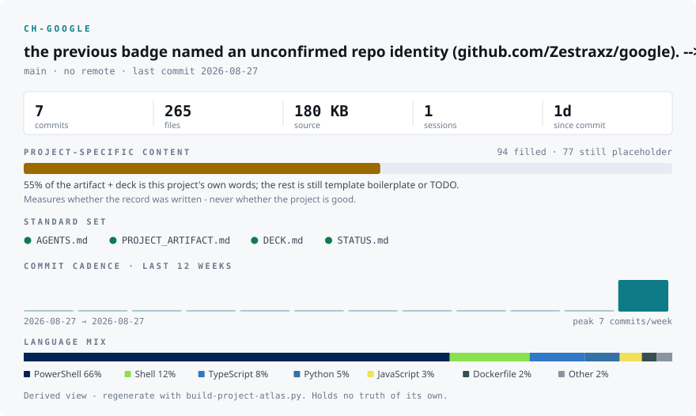

# CH-Google

> Google Workspace-native AI automation for the owner's recurring work: a **DWR Agent** (Gemini
> Gem + Workspace Studio Flow — daily working report) and a **Research Engine** (Apps Script +
> Gemini API — scout → deep-research → executive-deck pipeline).

<!-- OpenSSF Scorecard / CI badges deliberately removed until a git remote exists (D-016):
     the previous badge named an unconfirmed repo identity (github.com/Zestraxz/google). -->

---

<!-- ATLAS:BEGIN (generated by build-project-atlas.py - do not edit inside) -->

  <picture>
    <source media="(prefers-color-scheme: dark)" srcset="docs/atlas-dark.svg">
    
  </picture>

Generated by <a href="scripts/07-visualize/build-project-atlas.py"><code>build-project-atlas.py</code></a> - re-run it after any meaningful change. It is a <em>derived</em> view (D-009 R6); fix the source, then re-render.

<!-- ATLAS:END -->

## What it does

Two automations that live entirely inside the owner's Google account — no servers, no paid infra:

1. **DWR Agent** — a Gemini Gem ("DWR Commander") reconstructs the actual workday from
   Gmail/Chat/Calendar/Drive/Docs/Sheets and a Workspace Studio Flow runs it daily at 5 PM: logs to
   a `DWR_Master` sheet, emails the full analytical report to self, and **drafts** (never
   auto-sends) a compact version for the manager.
2. **Research Engine** — an Apps Script bound to a tracker sheet: daily topic scoring (web-grounded
   Gemini calls), daily deep-research reports appended to a master doc for topics scoring ≥ 7, and
   a weekly synthesized executive report + PPTX deck by email.

**Start here:** [02_active/ARCHITECTURE.md](02_active/ARCHITECTURE.md) (real architecture +
blueprint corrections) → [src/apps-script/README.md](src/apps-script/README.md) (deploy, validate,
operate) → [STATUS.md](STATUS.md) (what is actually evidenced vs claimed).

> The founding blueprints are Gemini chat exports in untracked `.resource/` (cited in prose, never
> committed — D-014). They contain verified defects; **do not deploy from them**. The corrected,
> canonical record is this repo: `02_active/ARCHITECTURE.md` + `src/apps-script/Code.gs` (v3.1).

## Project intelligence — where everything lives

> Stable pointers only - no numbers, no status words (those rot; they live in the files below).

| What you want                                  | Where                                                                      | Kept fresh by                                             |
| ---------------------------------------------- | -------------------------------------------------------------------------- | --------------------------------------------------------- |
| Current state & phase                          | [STATUS.md](STATUS.md)                                                     | every meaningful commit                                   |
| Living record - decisions / results / evidence | [PROJECT_ARTIFACT.md](PROJECT_ARTIFACT.md)                                 | artifact duty (AGENTS.md §13), every meaningful event     |
| Architecture + blueprint corrections           | [02_active/ARCHITECTURE.md](02_active/ARCHITECTURE.md)                     | any load-bearing change                                   |
| Deploy / validate / operate                    | [src/apps-script/README.md](src/apps-script/README.md)                     | each deployment touch                                     |
| Session transcripts (redacted)                 | `docs/01-session/transcripts/`                                             | session-end backup                                        |
| Quality audits & coverage                      | `docs/04-quality/critic/`                                                  | weekly Radar + `/critic`                                  |
| Portfolio brain (read first)                   | the Brain repo - `MEMORY/CURRENT_PRIORITIES.md`, `MEMORY/PROJECT_INDEX.md` | learning loop (AGENTS.md §1b)                             |
| This project's knowledge pack                  | Brain `PROJECTS/CH-Google/PROJECT.md`                                      | session end, every meaningful event                       |
| Session ledger (Reasoning Trail)               | `docs/01-session/`                                                         | session end (AGENTS.md §13)                               |
| Binding conventions                            | [AGENTS.md](AGENTS.md)                                                     | canonical                                                 |

## Deploying the systems

There is nothing to run locally — both systems deploy into Google surfaces:

- **Research Engine:** follow [src/apps-script/README.md](src/apps-script/README.md) §1
  (Drive setup → paste `Code.gs` → Script Properties key → triggers) and **run the §3 validation
  protocol before trusting any output**.
- **DWR Agent:** built in the Workspace Studio UI per the blueprint **with corrections D1–D8**
  ([ARCHITECTURE.md §2](02_active/ARCHITECTURE.md)) — Draft-only manager email and the injection
  guard are non-negotiable.

## Stack

- **Runtime:** Google Workspace (Gemini Gems, Workspace Studio Flows, Apps Script, Sheets/Docs/Slides/Gmail)
- **AI:** Gemini API (key from Google AI Studio, stored in Apps Script Script Properties only) — model cascade `gemini-3.7-flash → 3.6 → 3.5`
- **Repo tooling:** Claude Code + the `.Critic/` quality kit; docs tree `docs/00-99`

Template scaffold (generic CH-repo baseline — not used by the Google-side systems)

This repo was instantiated from the CH full-stack scaffold; the web-app portions (`apps/`,
`packages/`, docker-compose files, `01_setup/run.*`, GUI launchers in `tools-gui/`, the
pre-production checklist in earlier revisions) are **template baseline, not part of this project's
deliverable**. They stay for potential future use; nothing listens on localhost:3000/8000 here.
Full tree: [PROJECT_STRUCTURE.md](PROJECT_STRUCTURE.md).

## Documentation

| Where                                        | What                                                                    |
| -------------------------------------------- | ----------------------------------------------------------------------- |
| [AGENTS.md](AGENTS.md)                       | Canonical AI-assistant brief (per [agents.md spec](https://agents.md/)) |
| [STATUS.md](STATUS.md)                       | Where the project stands right now                                      |
| [02_active/](02_active/)                     | Architecture, roadmap, phase notes, issues & learnings                  |
| [src/apps-script/](src/apps-script/)         | Canonical Research Engine code + runbook                                |
| [docs/02-governance/](docs/02-governance/)   | Contributing, governance, security                                      |
| [docs/04-quality/adr/](docs/04-quality/adr/) | Architecture Decision Records                                           |
| [docs/04-quality/critic/](docs/04-quality/critic/) | Self-critic coverage map + refuted ledger                         |

## Contributing

See [docs/02-governance/CONTRIBUTING.md](docs/02-governance/CONTRIBUTING.md).
Code style and AI workflows: [CLAUDE.md](CLAUDE.md).

## License

MIT — see [LICENSE](LICENSE).
