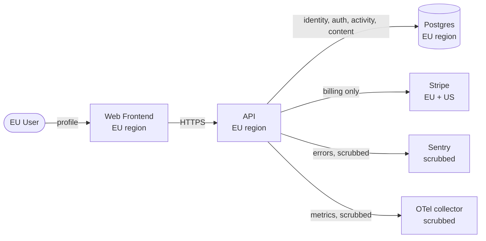

# Data Flow Diagram (GDPR Article 30 record)

> What personal data flows where. Required under EU GDPR Art. 30 for any project processing EU resident data.

---

## Data categories

| Category | Examples            | Source        | Storage                        | Retention        | Lawful basis        |
| -------- | ------------------- | ------------- | ------------------------------ | ---------------- | ------------------- |
| Identity | email, name         | user signup   | Postgres `users` table         | account lifetime | Contract            |
| Auth     | password hash       | user signup   | Postgres `users.password_hash` | account lifetime | Contract            |
| Activity | login times, IP     | login flow    | Postgres `audit_log`           | 1 year           | Legitimate interest |
| Content  | user-submitted text | feature usage | Postgres + S3                  | per-feature      | Contract            |
| Billing  | card last4, address | checkout      | Stripe (not our DB)            | Stripe retention | Contract            |

## Flow diagram

## Third-party processors

| Processor | Data shared              | DPA on file | Subprocessors                |
| --------- | ------------------------ | ----------- | ---------------------------- |
| AWS / GCP | All categories           | YES         | per cloud provider list      |
| Stripe    | Billing                  | YES         | per Stripe subprocessor page |
| Sentry    | Error details (scrubbed) | YES         | per Sentry subprocessor page |

## Cross-border transfers

- EU -> US for Stripe: SCCs (Standard Contractual Clauses) in place.
- All other processing: EU region only.

## Data subject rights

See [../docs/02-governance/PRIVACY.md](../docs/02-governance/PRIVACY.md) for the workflow.

## Last review

YYYY-MM-DD by Chan Hoe.
