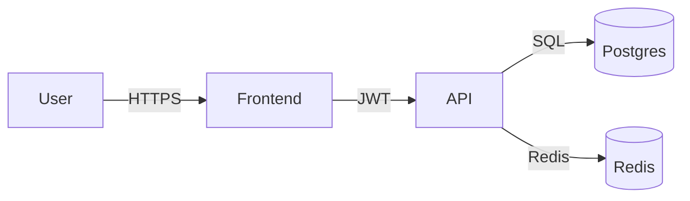

# Threat Model - Google

> STRIDE table per data-flow. Reviewed annually + on architecture change.
> Heavier methods (PASTA, attack trees) reserved for crown-jewel systems.

---

## Scope

Asset under modeling: {{TODO: e.g., "Authentication subsystem", "Payment flow"}}

## Data-flow diagram

## STRIDE per flow

### Flow 1: User -> Frontend (HTTPS)

| STRIDE                 | Threat                              | Mitigation                     | Status  |
| ---------------------- | ----------------------------------- | ------------------------------ | ------- |
| Spoofing               | Phishing site impersonates frontend | HSTS, EV cert, CSP report-only | Done    |
| Tampering              | MITM injects scripts                | TLS 1.2+, HSTS                 | Done    |
| Repudiation            | User denies action                  | Audit log (Postgres)           | Done    |
| Information disclosure | Session token in URL fragment       | Cookie-based auth only         | Done    |
| Denial of service      | Mass request from bot               | Cloudflare rate limit          | Partial |
| Elevation of privilege | Stolen cookie used cross-origin     | sameSite=lax, secure, httpOnly | Done    |

### Flow 2: Frontend -> API (HTTPS JWT)

| STRIDE                 | Threat                 | Mitigation                                  | Status |
| ---------------------- | ---------------------- | ------------------------------------------- | ------ |
| Spoofing               | Forged JWT             | RS256 with key rotation                     | Done   |
| Tampering              | Modified request body  | Zod validation; audit log                   | Done   |
| Repudiation            | API call without trail | Correlation ID in audit log                 | Done   |
| Information disclosure | Verbose error messages | Generic 5xx responses; details in logs only | Done   |
| Denial of service      | Endpoint flooding      | Redis token bucket per IP + per user        | Done   |
| Elevation of privilege | Authz bypass           | Middleware on EVERY route; deny by default  | Done   |

### Flow 3: API -> Postgres (SQL)

| STRIDE                 | Threat                                | Mitigation                                   | Status  |
| ---------------------- | ------------------------------------- | -------------------------------------------- | ------- |
| Spoofing               | API impersonation (compromised creds) | Short-lived OIDC; secret rotation            | Partial |
| Tampering              | SQL injection                         | Parameterized via Prisma ONLY                | Done    |
| Repudiation            | Untraceable DB writes                 | RLS audit; postgres audit extension          | TODO    |
| Information disclosure | Dump via leaked creds                 | Encrypted backups + at-rest; IAM-only access | Done    |
| Denial of service      | Long-running query                    | Statement timeout (30s); pool limits         | Done    |
| Elevation of privilege | RW user used for reads                | Separate readonly role                       | Done    |

## High-priority risks (P0/P1)

1. {{TODO: e.g., "Statement-timeout-bypass via prepared statement"}} - P1
2. {{TODO}} - P0

## Methodology references

- [OWASP STRIDE](https://owasp.org/www-community/Threat_Modeling_Process)
- [Microsoft STRIDE intro](https://learn.microsoft.com/en-us/azure/security/develop/threat-modeling-tool)
- For deeper analysis: [PASTA (7-stage)](https://owasp.org/www-pdf-archive/AppSecEU2012_PASTA.pdf) - reserve for high-stakes systems.

## Review log

| Date       | Reviewer  | Summary          |
| ---------- | --------- | ---------------- |
| YYYY-MM-DD | Chan Hoe | Initial baseline |
