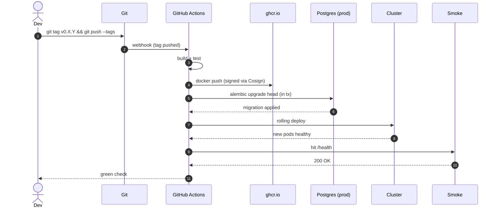

# Runbook — Google

> Operational playbook. When things go wrong (or right), this is the source of procedures.

---

## On-call quick reference

| Issue         | Page                                     | First action                                  |
| ------------- | ---------------------------------------- | --------------------------------------------- |
| API down      | [§API down](#api-down)                   | Check `docker compose ps`; restart if needed  |
| DB down       | [§Database down](#database-down)         | Check disk space; check connection pool       |
| High latency  | [§High latency](#high-latency)           | Check Grafana dashboard; check slow query log |
| OOM           | [§Memory exhaustion](#memory-exhaustion) | Scale horizontally or increase pod memory     |
| Deploy failed | [§Failed deploy](#failed-deploy)         | Read CI logs; check migration applied cleanly |

## Healthchecks

| Service  | Endpoint                            | Expected                |
| -------- | ----------------------------------- | ----------------------- |
| API      | `GET /health`                       | `{"status":"ok"}`       |
| Worker   | (none — check queue depth in Redis) | Depth < 100             |
| Postgres | `pg_isready`                        | `accepting connections` |
| Redis    | `redis-cli ping`                    | `PONG`                  |

## Deployment

### Pre-deploy checklist

- [ ] CI green on the commit being deployed
- [ ] [CHANGELOG.md](../../CHANGELOG.md) updated (move Unreleased → versioned)
- [ ] Database migrations tested on staging
- [ ] Healthcheck endpoints return 200 on staging
- [ ] Rollback plan written (see below)
- [ ] On-call notified

### Deploy steps

```bash
# Tag the release
git tag v0.X.Y && git push --tags

# CI runs:
# 1. Build Docker images
# 2. Push to registry
# 3. Run migrations against prod DB (in transaction)
# 4. Rolling deploy (new pods come up healthy before old ones drain)
# 5. Run smoke test
```

### Deploy flow (diagram)



### Rollback

```bash
# Option A — re-deploy previous tag
git tag -l | tail -5                   # find previous tag
# CI deploys tag (manually triggered)

# Option B — database migration rollback (rare)
alembic downgrade -1                   # or pnpm db:migrate:undo
# Then re-deploy
```

**Migrations are forward-only by default.** If you must roll back the schema, write a new forward migration that reverses the change.

## Incident playbooks

### API down

**Symptom:** `/health` returns 5xx or times out.

1. `docker compose ps` — is the container running?
2. `docker compose logs api --tail=200` — what does it say?
3. Common causes:
   - Postgres unreachable → see [§Database down](#database-down)
   - OOM → see [§Memory exhaustion](#memory-exhaustion)
   - Bad env var (e.g., `DATABASE_URL` typo) → check `.env` / secret manager
4. Restart: `docker compose restart api`
5. If repeated restarts fail: roll back the last deploy.

### Database down

**Symptom:** `pg_isready` fails; API logs show "could not connect."

1. `docker compose logs postgres --tail=200`
2. Check disk: `df -h` — if > 90%, you're out of space.
3. Check connections: `SELECT count(*) FROM pg_stat_activity;` — if at pool limit, restart API to release.
4. Restart Postgres: `docker compose restart postgres`. **Will drop in-flight transactions.**
5. If data corruption suspected: stop writes, restore from latest backup (see [§Backups](#backups)).

### High latency

**Symptom:** API p95 > 500ms; Grafana alert firing.

1. Check Grafana: which endpoint? Which downstream?
2. Check Postgres slow query log: `SELECT * FROM pg_stat_statements ORDER BY mean_exec_time DESC LIMIT 10;`
3. Check Redis: `redis-cli INFO commandstats` — any pathological command?
4. Common causes:
   - Missing index (add it; deploy migration)
   - N+1 query (fix in code)
   - Cold cache after restart (will resolve in minutes)

### Memory exhaustion

**Symptom:** Pod killed (OOMKilled); kernel OOM-killer in dmesg.

1. Check process memory: `docker stats`.
2. Common causes:
   - Memory leak (heap dump → analyze)
   - Unbounded query result (add pagination)
   - Caching everything (add LRU bounds)
3. Short-term: increase memory limit.
4. Long-term: fix root cause.

### Failed deploy

1. Read CI logs from the failed step.
2. If migration failed: it should have rolled back in-transaction. Verify schema state with `\d <table>`.
3. If build failed: fix locally, re-tag.
4. If smoke test failed: rollback (above), then investigate.

## Backups

- **Postgres:** daily logical dump to {{BACKUP_STORE}}, 30-day retention.
- **Object store:** versioning enabled.
- **Restore drill:** quarterly (calendar reminder).

Restore command:

```bash
docker exec -i google-postgres psql -U $POSTGRES_USER $POSTGRES_DB < backup.sql
```

## Observability

| Signal  | Tool                 | URL             |
| ------- | -------------------- | --------------- |
| Logs    | Loki / CloudWatch    | {{LOGS_URL}}    |
| Metrics | Prometheus / Grafana | {{METRICS_URL}} |
| Traces  | Jaeger / Tempo       | {{TRACES_URL}}  |
| Errors  | Sentry               | {{SENTRY_URL}}  |
| Status  | Status page          | {{STATUS_URL}}  |

## Security hardening (pre-prod)

- [ ] No default passwords (`change-me-*` strings) anywhere
- [ ] `JWT_SECRET` is ≥ 64 random bytes
- [ ] `CORS_ORIGINS` is an exact allowlist (no `*`)
- [ ] TLS 1.2+ enforced at edge
- [ ] Database not publicly reachable (private subnet)
- [ ] Backups encrypted
- [ ] Audit log enabled and reachable
- [ ] Dependency scan clean (`pnpm audit`)
- [ ] Container images scanned (`trivy image`)
