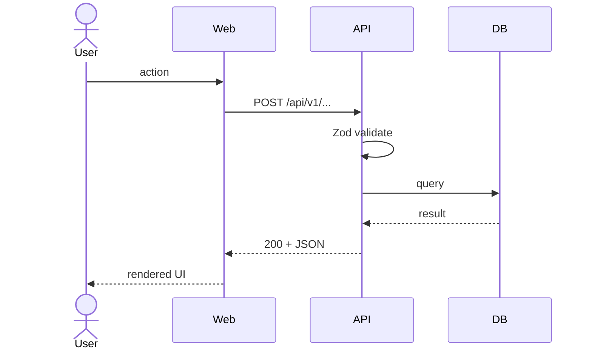

# 6. Runtime View

## Critical happy paths

{{TODO: sequence diagrams for top 3 user flows}}

```mermaid
sequenceDiagram
    actor User
    participant Web
    participant API
    participant DB

    User->>Web: action
    Web->>API: POST /api/v1/...
    API->>API: Zod validate
    API->>DB: query
    DB-->>API: result
    API-->>Web: 200 + JSON
    Web-->>User: rendered UI
```

## Critical error paths

{{TODO: how does the system degrade?}}
